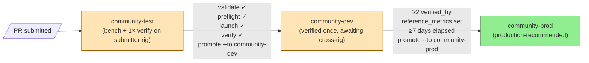

# Configs for community — how to submit + validate

This is the practical "how do I contribute a model config" guide. If you have
a working Genesis vLLM setup on YOUR hardware (3090, 4090, A6000, H100, mix
of GPUs, whatever) and want to share it back so other community members can
use the same config, this is the path.

For the in-depth schema reference see [MODEL_CONFIG_LAUNCHER.md](MODEL_CONFIG_LAUNCHER.md).

## What is a "config"?

One YAML file in `vllm/sndr_core/model_configs/community/<your-key>.yaml`
that captures **everything** needed to reproduce + verify a Genesis vLLM
launch on a specific (model × hardware × workload) combination:

- model path, quantization, KV dtype
- vLLM serve flags (max_model_len, gpu_memory_utilization, etc.)
- Genesis env (which P*/PN* patches to enable)
- system env (PYTORCH_*, VLLM_*, NCCL_*, etc.)
- expected reference metrics (TPS, tool quality, VRAM)
- lifecycle state (where in the verification ladder)

## The 5-stage validation pipeline

Every config — yours or builtin — goes through the same pipeline. Anyone can
run any stage at any time:

```
                  ┌──────────────────────────────────────────────┐
                  │  YAML edit / submit                          │
                  └────────────────┬─────────────────────────────┘
                                   ↓
   1. validate    schema + 18 audit rules (offline, ~50ms)
                                   ↓
   2. preflight   env + dependencies + hardware sanity (~3s)
                                   ↓
   3. launch      boot vLLM container with this config (~2-5min)
                                   ↓
   4. verify      bench + compare to reference_metrics (~5-10min)
                                   ↓
   5. promote     advance lifecycle state (community-test → -dev → -prod)
```

## Step-by-step: contribute YOUR first config

### 0. Pre-flight: have a working Genesis install + a model that loads

```bash
# Already done curl|bash install? Verify:
sndr doctor                # all green?
sndr verify --quick        # smoke test passes?
```

If both are green you're ready. If not, fix those first via
[INSTALL.md](INSTALL.md) and [DAY_1_CHECKLIST.md](DAY_1_CHECKLIST.md).

### 1. Clone the closest builtin config

```bash
# Browse what's already there
genesis model-config list

# Pick the closest match (similar GPU, similar model size) and clone:
genesis model-config new my-rig-3090-qwen3.6-27b \
    --template a5000-1x-27b-int4-tested
# Creates: ~/.genesis/model_configs/my-rig-3090-qwen3.6-27b.yaml
```

### 2. Edit the YAML on YOUR rig

Open the new file, update at minimum:
- `key:` to your kebab-case identifier
- `title:` human-readable name
- `description:` 1-2 sentences ("what this config is good for")
- `maintainer:` your GitHub handle
- `hardware.gpu_match_keys:` your GPU model (lowercase substring of `nvidia-smi --query-gpu=name`)
- `hardware.n_gpus:` 1, 2, 4, ...
- `hardware.min_vram_per_gpu_mib:` actual VRAM minus reasonable buffer
- `model_path:` full path to weights (or HF model id)

For lifecycle declaration:
```yaml
lifecycle: community-test            # MUST start here
community_submitted: true            # MUST be true for any community-* lifecycle
verified_by: []                      # filled in by `genesis model-config promote`
test_started_at: '2026-05-06'        # today's ISO date
```

### 3. Run validation locally — `validate`

```bash
genesis model-config validate my-rig-3090-qwen3.6-27b
```

What it checks (5-second offline lint):
- **Schema:** required fields, type correctness, enum membership
- **18 audit rules:** TPS for `community-prod` requires `reference_metrics`;
  TQ k8v4 + Hybrid GDN requires P98; lifecycle gates; pin coherence; etc.

Failure modes:
- `SchemaError: ModelConfig.lifecycle must be one of ...` → fix typo
- `R-015: lifecycle: community-prod requires reference_metrics` → see step 6
- `audit warning: TQ k8v4 + hybrid model needs GENESIS_ENABLE_P98` → add the env

### 4. Run preflight — `preflight`

```bash
genesis model-config preflight my-rig-3090-qwen3.6-27b
```

What it checks (3-second sanity):
- model files exist at `model_path`
- declared genesis_env values match real `PATCH_REGISTRY` entries (no typos)
- vLLM pin matches `vllm_pin_required` (or warn)
- GPU type matches `hardware.gpu_match_keys`
- VRAM available ≥ `hardware.min_vram_per_gpu_mib`

Common failures:
- `model_path /models/X not found` → fix path
- `unknown env var GENESIS_ENABLE_P83` → archived patch, remove from config
- `GPU 'nvidia geforce rtx 3090' does not match ['rtx a5000']` → update gpu_match_keys

### 5. Boot it — `launch`

```bash
genesis model-config launch my-rig-3090-qwen3.6-27b
# OR same thing via the unified launcher:
sndr launch my-rig-3090-qwen3.6-27b
```

Watch the boot:
```bash
docker logs -f vllm-server
```

Expected signals:
- `[Genesis Dispatcher] APPLY <patch>` lines for each enabled P*/PN*
- `Application startup complete` at the end
- Healthcheck: `curl -fsS http://127.0.0.1:8000/v1/models` returns the model

If boot fails — capture the last 200 log lines and the error class. Common
patterns are documented in [CLIFFS.md](CLIFFS.md) and [OOM_RECIPES.md](OOM_RECIPES.md).

### 6. Capture reference metrics — `bench-and-update`

Once boot is healthy:

```bash
genesis model-config bench-and-update my-rig-3090-qwen3.6-27b
```

Runs a comprehensive bench (short_gen, long_gen, tool_call, stability,
concurrent×4, VRAM) and writes `reference_metrics:` block back into your
YAML. Surgical edit — preserves your comments + ordering.

Alternatively, if you already have a bench tool you trust, fill the block
manually:
```yaml
reference_metrics:
  measured_at: '2026-05-06'
  bench_method: my-tool-v2
  long_gen_sustained_tps: 87.4
  long_gen_mean_lat_s: 11.4
  tool_call_score: '10/10'
  stability_mean_s: 1.5
  stability_cv_pct: 0.42
  vram_used_mib_per_gpu: [22000, 22000]
  vram_total_mib: 44000
  genesis_pin: 'abc1234'
  vllm_pin: '0.20.2rc1.dev371+gbf610c2f5'
```

### 7. Verify against reference — `verify`

```bash
genesis model-config verify my-rig-3090-qwen3.6-27b
```

Re-runs bench, compares to your `reference_metrics`, applies
`verify_tolerances`. If the running rig matches the reference (within
typical CV noise), verify PASSES.

Now you've proven the config reproduces on YOUR rig. To prove cross-rig you
need someone else's machine.

### 8. Submit a PR

```bash
# Move the file from user/ to community/
mv ~/.genesis/model_configs/my-rig-3090-qwen3.6-27b.yaml \
   <genesis-repo>/vllm/sndr_core/model_configs/community/

# git add + commit + push your branch + open PR using the template
```

The PR template (`.github/ISSUE_TEMPLATE/community_config.md`) asks for the
exact verify output — paste it in.

### 9. Promote — community-test → community-dev

After someone else (a Genesis maintainer or another community member) clones
your branch and runs `genesis model-config verify <key>` successfully:

```bash
# Maintainer side, on their rig:
genesis model-config promote my-rig-3090-qwen3.6-27b \
    --to community-dev \
    --rig-tag rtx-3090-2x \
    --handle reviewerhandle
```

This appends `<rig>@<handle>-<today>` to `verified_by` and flips
`lifecycle: community-test → community-dev`. Schema re-validates after edit.

### 10. Final promotion — community-dev → community-prod

Three hard gates ALL must pass:

1. **`verified_by` has ≥2 distinct entries** (cross-rig validation —
   reviewer-on-3090 + reviewer-on-4090, or similar)
2. **`reference_metrics` is set**
3. **≥7 days since `test_started_at`** (cooling-off — avoids hot-take
   promotions; use `--force` only with strong reason)

```bash
genesis model-config promote my-rig-3090-qwen3.6-27b --to community-prod
```

After this, your config appears with `lifecycle: community-prod` and is
recommended alongside Genesis builtin stables.

## Lifecycle visualisation



## What if validation fails — diagnostic recipes

| Symptom | Likely cause | Fix |
|---|---|---|
| `SchemaError: lifecycle must be one of ...` | typo in lifecycle name | use exact: `community-test`, `community-dev`, `community-prod` |
| `R-015 reference_metrics required` | `community-prod` without metrics | run `bench-and-update` |
| `R-018 hybrid capacity OOM` | TQ k8v4 + Hybrid + KV size mismatch | reduce `max_model_len` OR reduce `max_num_seqs` |
| `unknown env var GENESIS_ENABLE_P83` | references retired/archived patch | grep `dispatcher.py PATCH_REGISTRY` for valid IDs |
| `gpu_match_keys missing` | empty list | add at least one substring like `['rtx 3090']` |
| `community_submitted=true requires lifecycle ∈ ...` | mismatch between flag and lifecycle | flip both consistently |
| `verified_by < 2 for community-prod` | only one rig validated | get a second rig validation before promoting |
| `cooling-off window <7 days` | promoting too early | wait, OR use `--force` if there's a strong reason |
| boot fails with `cudaErrorIllegalAddress` on GDN | Cliff 2b on hybrid model | enable PN59 in genesis_env |
| boot fails with `prefix-cache + DS conv` | hybrid GDN + prefix cache | remove `--enable-prefix-caching` from `vllm_extra_args` |

## Multi-runtime + portable paths (W-runtime 2026-05-06)

**Don't hardcode personal paths.** SNDR configs travel between rigs —
your `/data/models` is someone else's `/mnt/models`. Use symbolic
mount references:

```yaml
docker:
  mounts:
    - ${models_dir}:/models:ro              # ← portable
    - ${hf_cache}:/root/.cache/huggingface:ro
    - ${sndr_src}:/usr/local/lib/python3.12/dist-packages/vllm/sndr_core:ro
    # NOT this — non-portable, breaks on every other rig:
    # - /home/user/specific-project/models:/models:ro
```

Variables resolve via `~/.sndr/host.yaml` — auto-detected at
`install.sh` time per-rig. `genesis model-config validate <key>` (audit
rule R-019) catches typos / missing host.yaml entries BEFORE launch.

**Declare runtime support** via `deploy:` block:

```yaml
deploy:
  docker: true        # default — tested on docker
  podman: true        # if you've verified on podman
  bare_metal: true    # if your config also works as native venv
                      # (Proxmox LXC users: this is the recommended path
                      #  per noonghunna kernel 6.17.x footgun)
  kubernetes: false   # leave false until k8s manifests are in repo
  lxc_proxmox: false  # leave false (footgun)
  default: docker     # which runtime to use unless --runtime override
```

Operator picks runtime at launch:
```bash
genesis model-config render <key>                    # uses deploy.default
genesis model-config render <key> --runtime bare_metal
genesis model-config render <key> --runtime podman
```

Currently rendered: docker (existing), bare_metal (NEW), podman (NEW).
kubernetes + lxc_proxmox return clean placeholder errors — operator
manually translates compose to k8s manifest meanwhile (per
[noonghunna disc#48](https://github.com/noonghunna/club-3090/discussions/48)).

## Quick reference — the 5 commands you actually use

```bash
genesis model-config list                              # browse
genesis model-config validate <key>                    # 50ms offline lint
genesis model-config preflight <key>                   # 3s sanity check
sndr launch <key>                              # boot
genesis model-config verify <key>                      # bench vs reference
genesis model-config promote <key> --to community-dev  # advance lifecycle
```

## When NOT to submit a config

- You have **regressions** (TPS or quality) compared to the closest builtin
  config without explanation. PRs go faster if you root-cause the regression
  first.
- You depend on a vLLM pin different from the Genesis-supported pin. Write
  it up as an issue first, not a config.
- Your config requires patches NOT in `PATCH_REGISTRY`. Submit the patch first.

For everything else — your community-test config is welcome. The lifecycle
ladder makes contribution low-risk: if your config has a flaw, it stays in
`community-test` or `community-dev` until verified, never accidentally
gets promoted to recommended status.

## Related docs

- [INSTALL.md](INSTALL.md) — getting started
- [DAY_1_CHECKLIST.md](DAY_1_CHECKLIST.md) — first 30 min after install
- [MODEL_CONFIG_LAUNCHER.md](MODEL_CONFIG_LAUNCHER.md) — full schema reference
- [PATCHES.md](PATCHES.md) — what each P* / PN* does + decision tree
- [HARDWARE.md](HARDWARE.md) — supported hardware envelope
- [CLIFFS.md](CLIFFS.md) — known failure modes
- [CONTRIBUTING.md](CONTRIBUTING.md) — broader contribution guidelines
